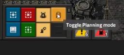

# Don't touch my ghost!

> Version 0.1.2

* added localisation strings for in-game messages
* on/off message is now only shown to the player, instead of whole server

> Non-Game-Changing, Utility, 0.17.6+

## Description

Always wanted to plan something in your factory, but nasty robots won't let you place blueprints in peace?
Fear not, fellow engineer, this mod comes to rescue!
And I'm not talking about personal roboport - I'm talking about both personal and ground roboport.
This mod does not disable any robots or affect them in any way. One click of a button and you can enjoy peaceful planning without being interrupted by millions of bots.

## How to use
Press Ctrl + Shift + G or a shortcut icon on the action bar to enable "Planning mode". 
Press again to switch back to a normal mode.

[YouTube demo](https://www.youtube.com/watch?v=2x9Uq-AyU0M)

## How it works
When placing a blueprint/ghost building in a "Planning mode" it's `force` is changed to `neutral`, see [LuaForce](https://lua-api.factorio.com/latest/LuaForce.html) for more details.

## Acknowledgements 
Icons made by [Freepik](https://www.flaticon.com/authors/freepik).

## Known issues
* Doesn't work with ground tiles (concrete, landfill etc).
* Doesn't allow to copy or cut ghost buildings placed in "Planning mode" (but still can remove by left-clicking).
* Doesn't allow to use deconstruction planner on ghost buildings placed in "Planning mode".